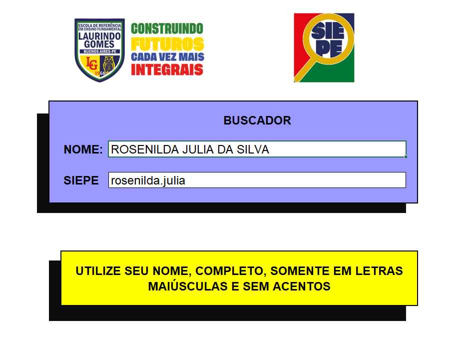

# **BUSCADOR DO SIEPE**

## **Catalogação**
| :placard: Vitrine.Dev |     |
| -------------  | --- |
| :sparkles: Nome        | **BUSCADOR DO SIEPE**
| :label: Tecnologias | excel e suas funções
| :rocket: URL         | não possui
| :fire: Desafio     | Desafio de Aprendizagem
| :calendar: Criação | 09/05/2022

## **COMO FUNCIONA?**
A ideia do *buscador do SIEPE* é que o estudante que queira consultar seu login do SIEPE, ao informar seu nome receba o login extao pelo qual poderá acessar suas informações no sistema integrado de educação de Pernambuco. 
Atualmente não há nenhuma ferramenta do SIEPE que possibilite que alunos confiram seus logins, caso esqueçam ou percam o local em que guardaram seu login e senha. Caso isso ocorra, a única solução do estudante é conferir com funcionários da secretaria quais são suas informações. Como, de acordo com as demandas do fim do bimestre, mebros da gestão da escola podem ficar muito sobrecarregados, estes estudantes podem não ter qualquer atendimento para saber seus dados e consequentemente suas notas, o buscador surge como ferramente de consulta, de pelo menos, o login. Outros serviços como desbloqueio do login, entretanto, só podem ser obtidos através do perfil da gestão, ou seja, os estudantes precisam esperar. 
O programa é simples, o arquivo possuim duas planilhas: 
1. DB SIEPE
2. CONSULTOR SIEPE

A planilha *DB SIEPE* recebe uma tabela de dados que contém, a lista do nome dos alunos, sua série e seu login, que será consultado pela planilha *CONSULTOR SIEPE* através da função abaixo:

>> **=SEERRO(PROCV(L11;'DB SIEPE'!A2:C226;3;FALSO); _"Erro, confira as regras e tente novamente!"_)**

na planilha *CONSULTOR SIEPE* existe um painel interativo, feito apenas com formatação do excel. A célula que recebe a função de consulta, avalia o resultado da célula L11 (o nome) e retorna o SIEPE do aluno consultado, ou uma mensagem de erro caso o nome informado não tenha no banco de dados, de acordo com as regras que estão destacadas em amarelo, abaixo do painel.

## **PRÉVIA DO PROGRAMA**
